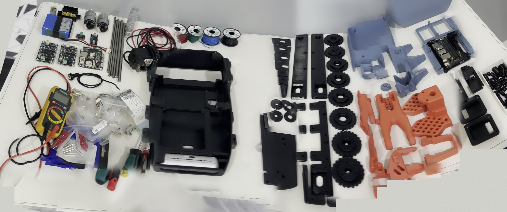
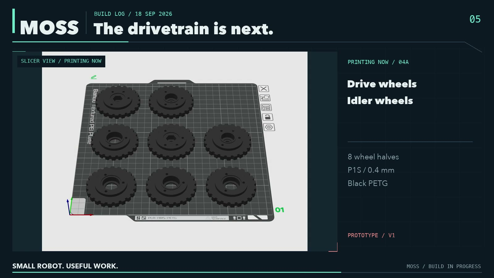
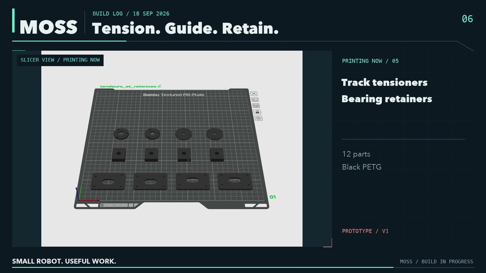
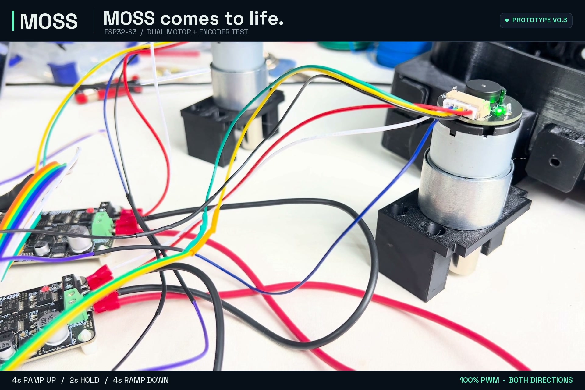
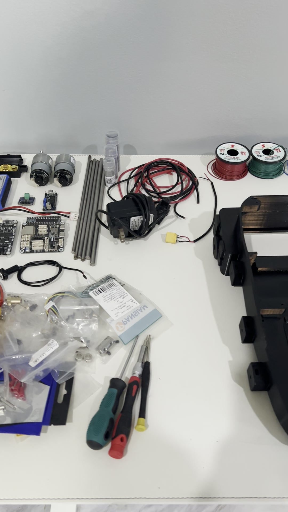
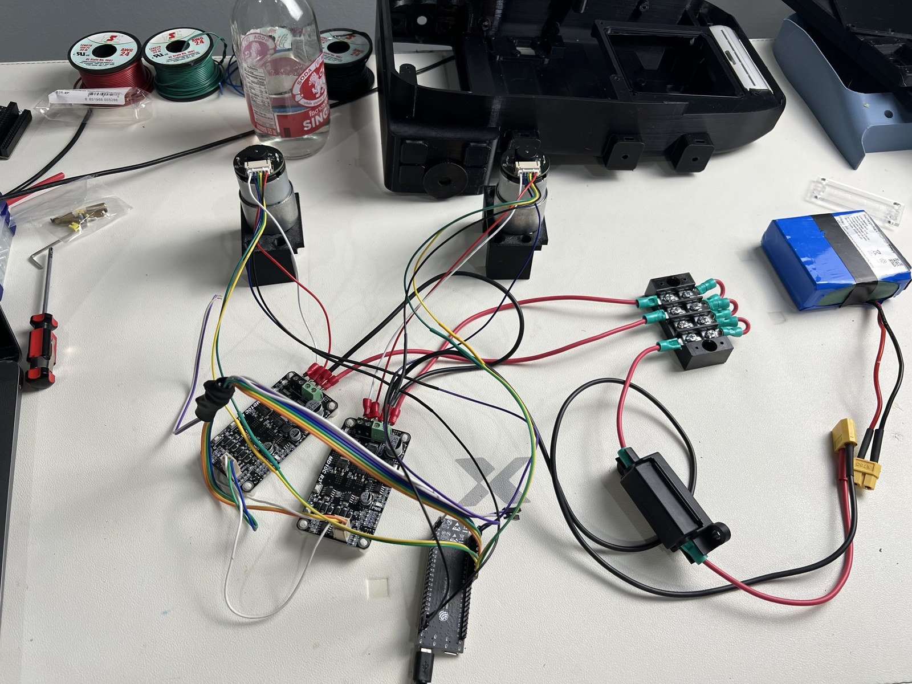
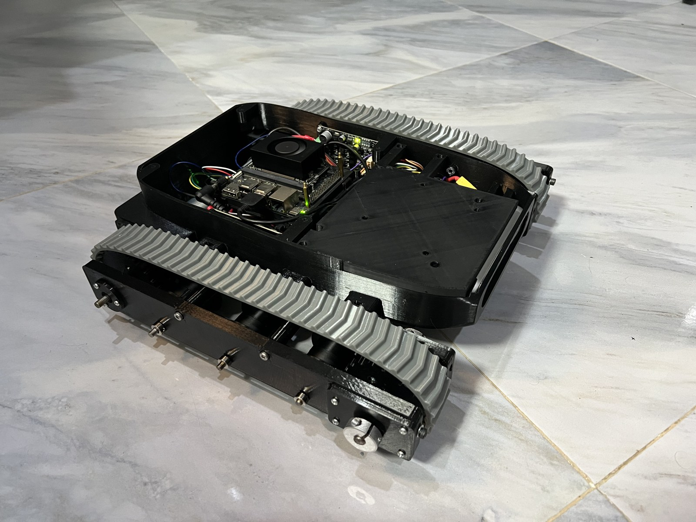
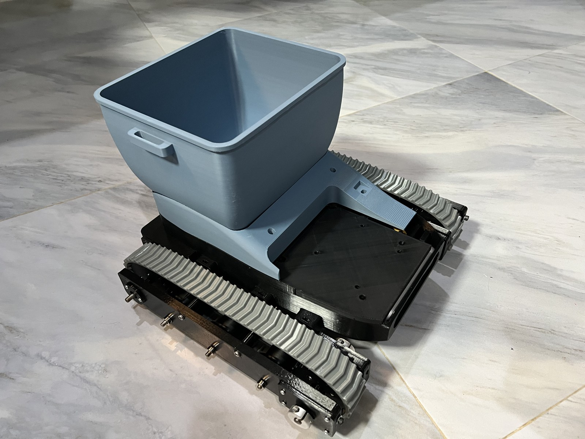
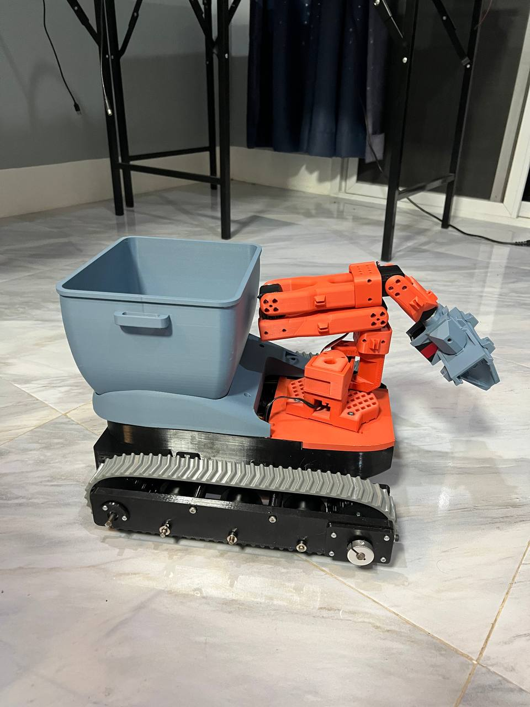
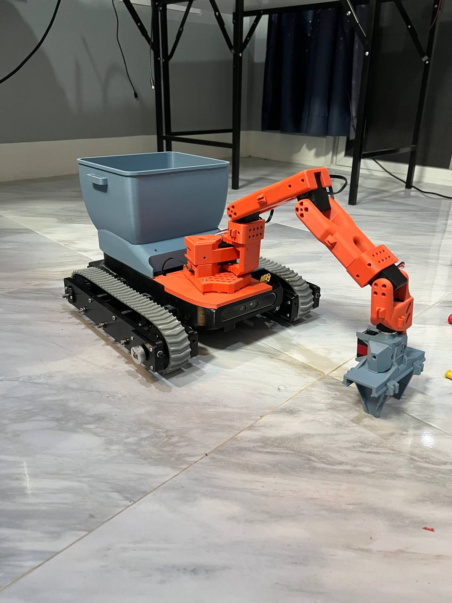

# Assembly

**Photos from the first prototype, V0.3, September 2026.** The step-by-step with the V0.6 parts is shot during the rebuild and replaces this page when the files come out. Read [docs/lessons.md](docs/lessons.md) before you start: it is short, and it is everything that bit us.

## 1. Lay out the print set

Check every part against the [list](3DPrinting.md). Push the bearings into the half-wheels and rollers now, while they are easy to reach.

## 2. Drivetrain plates

Rollers on their Ø5 shafts, idler wheels on Ø8, drive wheels on the HEX12 hubs. Collars on both sides of every shaft. Both tensioners on each side, slides and covers.

## 3. Motors, encoders and the control board on the bench

Flash the [firmware](firmware/), wire one motor at a time, run `test left 10` and `test right 10` and watch the encoder counts climb in the telemetry. Do this before anything goes into the hull.

## 4. Electronics into the hull

Motor driver, controller, servo adapter, power distribution and fuse into their mounts. Battery under the arm plate. Screw terminals, not jumper wires.

## 5. Tracks on

Fit the tracks, tension both sides until there is no sag under the hull, then put the rover on blocks and run `drive 10 10`. First drive on the floor only after that.

## 6. Bin and cover

Magnets in the cover and in the bin, pads under the bin.

## 7. Arm and gripper

Build the SO-101 arm with the upstream guide, then the NC90 gripper. Bolt the arm plate to the hull, route the servo bus and the camera cable through the clips.

## 8. Computer and sensors

Jetson or Pi on its plate, depth camera at the nose with the right-angle USB cable, lidar on its mount. Then [Software](Software.md).
