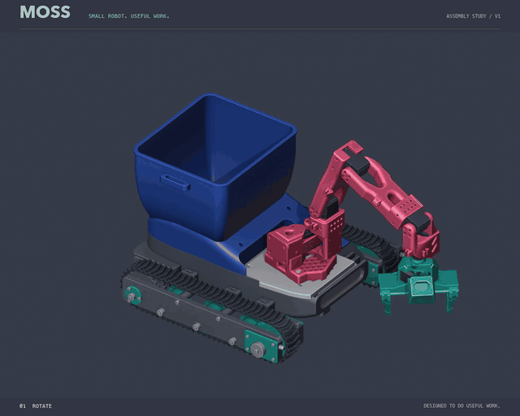
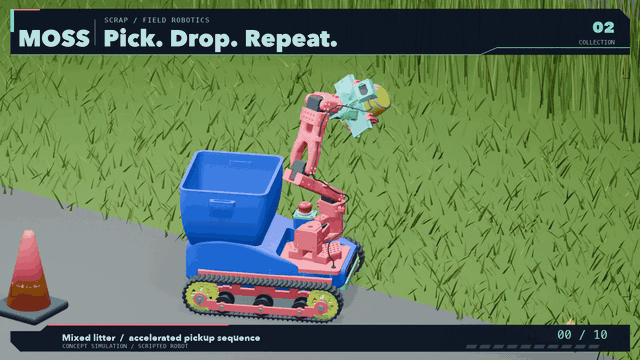
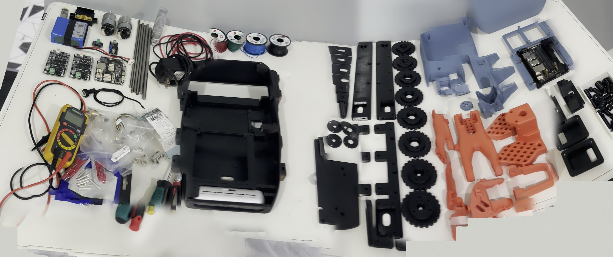
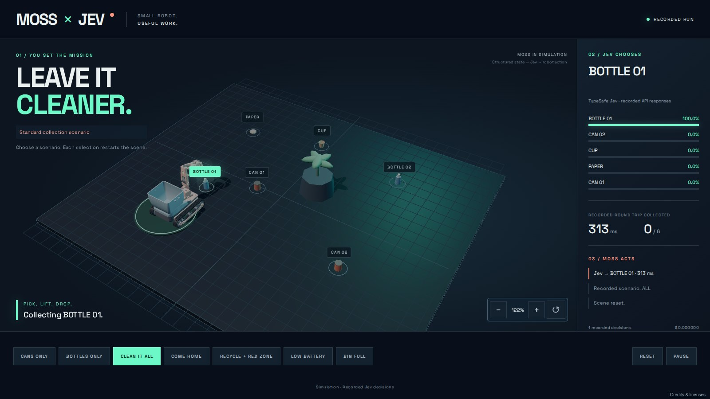

# MOSS

Cleaner streets, one maker at a time.

MOSS is a small litter-picking rover you can print and build yourself: a tracked base, a bin, and an arm derived from the SO-101 with a parallel gripper. About 500 to 700 USD in parts, plus a Jetson. It is being built in public, from a living room in Hua Hin, Thailand. Nothing here is finished; everything here is real.

## Where it stands

All 113 printed parts are on the bench, with the shafts, bearings and screws to go with them. On 20 September the two drive motors ran for the first time, encoders counting, from the ESP32 that will drive them on the rover. That is the whole story so far: it runs on the bench, it does not roll yet. Next is putting the harness inside the chassis and making it drive.

Every step is written down when it is real, good or bad. The [build log](docs/build_log.md) has the dates and the numbers, the [assembly feedback](docs/assembly_feedback.md) has what did not fit, the [roadmap](docs/roadmap.md) has what comes next, without dates.

## Try the demo

Jev, TypeSafe AI's decision model, choosing which piece of litter to go for, in 3D, on recorded runs: https://www.showrobotics.ai/moss-jev/

## What is in here

- `docs/` what MOSS is for, the build log, the bill of materials, the printed-parts list, the data rules, the roadmap.
- `firmware/` the ESP32-S3 code that drives the motors, with its test.
- `moss_dimos/` the Jetson side, on dimOS. Cold-tested only, for now.
- `hardware/` the design files, published part by part as they prove themselves on the real robot, and the raw bench traces.
- `media/` the videos and photos.

## Build one, or come and watch

The design files are not out yet. They come once the first MOSS rolls and the parts have earned it. Until then, the door is the Discord: ask anything, tell us what we are doing wrong, it helps the next builder too. https://discord.com/invite/x2MeNmgveT

The build, day by day, is on X: [@metrox_eth](https://x.com/metrox_eth).

Data recorded by MOSS builders is meant to be pooled and open, so the shared model gets better with every robot. The rules we propose are in [docs/data.md](docs/data.md).

## License

Code under Apache-2.0. Hardware files and documentation under CC BY 4.0. See `NOTICE`.
