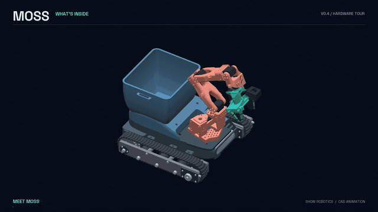
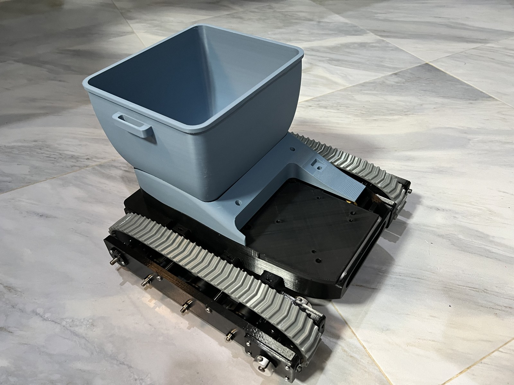

# MOSS

Cleaner streets, one maker at a time.

MOSS is a small litter-picking rover you can print and build yourself: a tracked base, a bin, and an arm derived from the SO-101 with a parallel gripper. About $1,700 in parts as built, with a Jetson and a RealSense; a Raspberry Pi version around $820 is the next experiment. It is being built in public, from a living room in Hua Hin, Thailand. Nothing here is finished; everything here is real.

**New here?** The day-by-day story is in the [build log](docs/build_log.md); what did not fit is in the [assembly feedback](docs/assembly_feedback.md); what it costs is in the [itemized budget](docs/bom-costs.md).

*40-second CAD animation of the V0.4 design: inside the hull, reassembly, and a scripted pickup. The physical prototype drives; autonomous pickup is still ahead. [Video version](media/video/MOSS_V04_Inside_and_Action_20260924.mp4).*

## Where it stands

*We forgot to take the wide shot, so this is 41 frames of a phone pan stitched together. It wobbles a bit; the parts are real.*

All 113 printed parts are on the bench, with the shafts, bearings and screws to go with them. On 20 September the two drive motors ran for the first time, encoders counting, from the ESP32 that will drive them on the rover. By the evening the electronics were inside the chassis and the Jetson was booting from the battery. Some parts ended up elsewhere than the CAD planned; that is what a first prototype is for. On 22 September it rolled for the first time. The tracks still have some slack, a second tensioner per track is next.

In parallel, **V0.4** is being drawn from the assembly feedback: a revised hull, screw-terminal control electronics, one dual motor driver instead of two. Not built yet. See the [V0.4 hardware update](docs/hardware_v04.md).

Every step is written down when it is real, good or bad. The [build log](docs/build_log.md) has the dates and the numbers, the [assembly feedback](docs/assembly_feedback.md) has what did not fit, the [roadmap](docs/roadmap.md) has what comes next, without dates.

## What does it cost?

| Build | Parts estimate |
|---|---:|
| As built: Jetson Orin Nano Super, RealSense D455, 2 TB SSD | about $1,680 |
| Next experiment: Raspberry Pi 5, Mighty Camera | $820 |
| Next experiment: Raspberry Pi 5, ST 3D time-of-flight | $821 |

Replacement-cost estimates for every part, not receipts. The Pi builds keep the same chassis, arm and drivetrain, and have not been tested yet. Every line, assumption and source is in the [itemized budget](docs/bom-costs.md); the [45-second comparison](media/video/MOSS_cost_comparison_20260921.mp4) tells it in pictures.

## Try the demo

Jev, TypeSafe AI's decision model, choosing every step of a pickup (approach, align, grasp, lift, carry, release) on physics recorded once in MuJoCo, replayed in 3D in your browser. Three missions with real Jev decisions, plus the earlier target-choice scenarios: https://www.showrobotics.ai/moss-jev/

The simulator behind it is open too: the MOSS body as a MuJoCo model with its meshes, the three recorded missions, and a CPU replay that needs no API key, in the demo repository's [`live/` folder](https://github.com/metrox-eth/moss-jev/tree/main/live). Import the body into your own lab, or replay the missions on your laptop.

## What is in here

- `docs/` what MOSS is for, the build log, the bill of materials, the printed-parts list, the data rules, the roadmap.
- `firmware/` the ESP32-S3 code that drives the motors, with its test.
- `moss_dimos/` the Jetson side, on dimOS. Cold-tested only, for now.
- `moss_pi/` the Raspberry Pi side: drives the same motor firmware over serial, keyboard or gamepad teleop, telemetry log. Cold-tested only, for now.
- `hardware/` the design files, published part by part as they prove themselves on the real robot, and the raw bench traces.
- `media/` the videos and photos.

## Build one, or come and watch

The design files are not out yet. The first MOSS now rolls; we are incorporating its assembly feedback into V0.4 before releasing the parts and their matching BOM. Until then, the door is the Discord: ask anything, tell us what we are doing wrong, it helps the next builder too. https://discord.com/invite/x2MeNmgveT

The build, day by day, is on X: [@metrox_eth](https://x.com/metrox_eth).

Data recorded by MOSS builders is meant to be pooled and open, so the shared model gets better with every robot. The rules we propose are in [docs/data.md](docs/data.md).

## License

Code under Apache-2.0. Hardware files and documentation under CC BY 4.0. See `NOTICE`.
