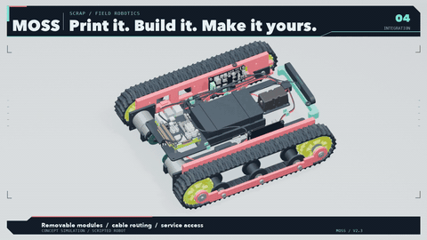
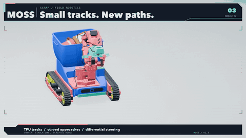

# MOSS

Cleaner streets, one maker at a time.

MOSS is a small, mostly 3D-printed litter-picking rover: tracked base, a collection bin, and an arm derived from the SO-101 with a NormaCore parallel gripper. Target parts cost: 500 to 700 USD plus a Jetson (before tax and shipping, labour and tools excluded). The goal is a design any maker can print, build, improve, and run where they live.

This repository is the build log, the design files as they become real, and the software as it gets written. It started on 15 September 2026. Nothing here is finished; everything here is real. The animation above is the concept simulation (scripted, not a trained policy); the photo below is the first printed parts.

## Status (17 September 2026)

- Printed: two flexible tracks (TPU 95A), the collection bin and its top cover (PLA).
- Printing: the main chassis (PETG), inner side rails, cross spacers, motor brackets.
- On the bench: Jetson Orin Nano 8 GB, Intel RealSense depth camera, Waveshare controller board, 2 × Cytron MD10C R3 motor drivers, 2 × geared motors with encoders, fuse holder, converter, interface modules.
- Ordered: steel shafts (5/6/8 mm), bearings (608, 626), shaft collars, 6 mm couplings, M3 and M4 fasteners.
- Software: a scaffold derived from [vector-dimos](https://github.com/metrox-eth/vector-dimos) (gamepad teleop and differential-drive kinematics, cold-tested, not yet run on the rover).
- CAD: designed in Fusion 360; STL and STEP exports will land in `hardware/` as each part is validated by a real print.

## Plan

1. Print, build, and run the base on a real roadside, teleoperated with a gamepad on [dimOS](https://github.com/dimensionalOS/dimos).
2. Mount the arm and gripper; collect teleop demonstrations in the LeRobot dataset format.
3. Train a first pick-up policy on pooled data. The first video of an autonomous pick will be exactly that: autonomous, or it will not be posted.
4. Publish the design and the build documentation so others can build their own.

## Data

Teleop data recorded by MOSS builders is meant to be pooled and open, so the shared model gets better with every robot. Details and the rules we propose are in [docs/data.md](docs/data.md).

## Layout

- `docs/` concept, build log, bill of materials, data, roadmap, software notes.
- `hardware/` design files (coming as parts are validated).
- `moss_dimos/` software scaffold (dimOS modules).
- `media/` videos and images of the concept and the build.
- `tests/` cold tests (no hardware needed).

## License

Code under Apache-2.0. Hardware files and documentation under CC BY 4.0. See `NOTICE`.

Built in public by [@metrox_eth](https://x.com/metrox_eth).
