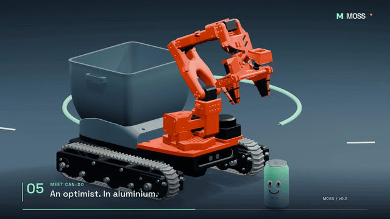
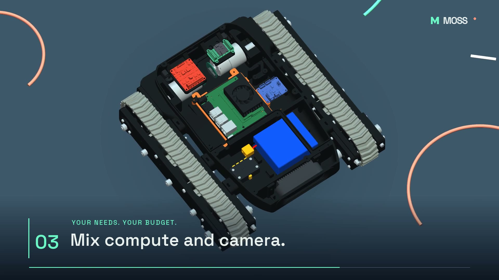

# MOSS

Cleaner streets, one maker at a time.

MOSS is a small litter-picking rover you print and build yourself: a tracked base, a bin on top, an arm derived from the SO-101 with a parallel gripper. It is open hardware, built in public, and meant to be built by many hands.

**Where it stands.** The first prototype rolls and carries its arm. Nothing has picked up litter on its own yet. The CAD is being finished on the real robot, and the files come out after one test: a full battery emptied over 3 km on the beach, tracks still on, no bolt lost. No date; it is posted when it is real.

## Two ways to get one

- **Build it yourself.** [Bill of materials](BOM.md) → [3D printing](3DPrinting.md) → [Assembly](Assembly.md) → [Software](Software.md). The STL and STEP files land in [`hardware/`](hardware/) when the design is frozen.
- **Get the kit.** Kits and an interactive build guide are coming with [Tnkr](https://x.com/tnkrdotai). [Join the waitlist](https://ak4khuvxkya.typeform.com/to/qaKmXNME) to hear when the files and the kits are ready.

## What it costs

Retail estimates for one rover, parts only. A kit will be cheaper.

| Configuration | Parts |
|---|---:|
| Kit base: chassis, tracks, arm, gripper, power, filament | about $480 |
| + Jetson Orin Nano Super, RealSense D455, wrist camera, 2D lidar | about $1,540 |
| + Raspberry Pi 5, Hailo AI HAT, Orbbec Gemini 2, wrist camera, 2D lidar | about $1,260 |
| + Raspberry Pi 5, Mighty camera, wrist camera, 2D lidar | about $890 |

The Jetson configuration is the one on the bench. Every line is in the [BOM](BOM.md).

## What it is made of

- Tracked base, two geared DC motors with encoders, printed TPU tracks, an ESP32-S3 driving the motors.
- A bin you empty by hand at the end of a run.
- An SO-101 arm (open source) with a NormaCore parallel-jaw gripper, widened to a 90 mm grip, and a small camera in the hand.
- A depth camera or a Mighty tracking camera at the nose, a 2D lidar for navigation.
- Software: dimOS for teleop and navigation, LeRobot for data and policies. A Raspberry Pi path without dimOS for the first drives.

The rule we build by: pick up more litter with less technology. Every part has to earn its place against a person with a bag.

## News

- 3 October 2026: V0.6 makes the hardware modular, Pi or Jetson, RealSense or Gemini. Waitlist open with Tnkr.
- 1 October 2026: V0.5, the release candidate for the open source CAD.
- 26 September 2026: arm and gripper mounted on the prototype.
- 22 September 2026: first drive.

## Friends

OpenAI (Codex Physical Builds), [Dimensional](https://x.com/dimensionalos) (dimOS), [NormaCore](https://x.com/norma_core_dev) (gripper), [Tnkr](https://x.com/tnkrdotai) (kits and guide), [Dirac Robotics](https://x.com/diracrobotics) (calibrated simulation), [microduck-lab](https://github.com/jonathanhawkins/microduck-lab) (reinforcement learning). We help each other.

## Simulation and autonomy, work in progress

The MOSS body runs in MuJoCo with three recorded pickup missions, in the [moss-jev](https://github.com/metrox-eth/moss-jev) repository. It is a basic model. Dirac Robotics is helping build a calibrated URDF, so the robot in MuJoCo behaves like the real one, to experiment with Dimensional's Dimcode; Dimensional is working on a navigation arena; microduck-lab is trying reinforcement learning on it. Accurate simulation, sim-to-real transfer, a modular stack, autonomy: all of it is part of the journey, none of it is here on day one.

## Come and build

Ask anything, tell us what we are doing wrong, it helps the next builder: [Discord](https://discord.com/invite/x2MeNmgveT). The build, as it happens: [@metrox_eth](https://x.com/metrox_eth). The story so far, in a few moments: [STORY.md](STORY.md). What we learned the hard way: [docs/lessons.md](docs/lessons.md). How data from many rovers gets pooled: [docs/data.md](docs/data.md).

## Safety

This is a prototype with a lithium battery and no certified protection. Put it on blocks for the first run. Build at your own risk.

## License

Code under Apache-2.0. Hardware files and documentation under CC BY 4.0. See `NOTICE`.
