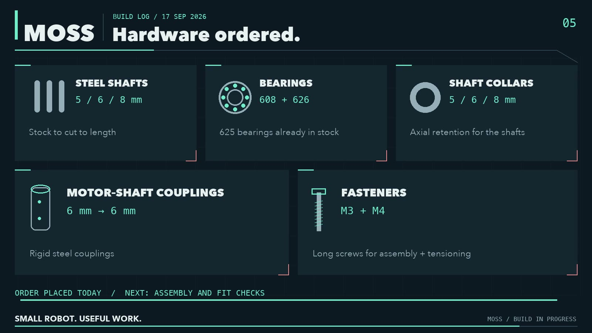

# Bill of materials (work in progress)

Target: 500 to 700 USD in parts plus a Jetson, before tax and shipping. Prices are not listed yet; they will be once the first unit is complete and the list is stable.

## Printed parts
| Part | Material | Printer used | Status |
|---|---|---|---|
| Track (×2) | TPU 95A | Bambu Lab P1S | printed |
| Collection bin | PLA | Bambu Lab H2S | printed |
| Top cover | PLA | H2S | printed |
| Main chassis | PETG (black) | H2S | printed |
| Inner side rails (×2) | PETG | P1S | printed |
| Cross spacers (×4) | PETG | P1S | printed |
| Outer side rails (×2) | PETG | P1S | printed |
| Motor brackets (×2) | PETG | P1S | printed |
| Drive and idler wheels (8 halves) | PETG | P1S | printing |
| Track tensioners + bearing retainers (12 parts) | PETG | P1S | printing |
| Splash-proof vent covers (×2) | PETG | — | printed |

## Electronics
- Jetson Orin Nano 8 GB (brain)
- Intel RealSense depth camera
- Waveshare controller board
- 2 × Cytron MD10C R3 motor drivers
- 2 × geared DC motors with encoders
- Fuse holder, DC converter, interface modules

## Mechanical hardware
- Steel shafts 5 / 6 / 8 mm (cut to length)
- Bearings 608 and 626 (625 also in stock)
- Shaft collars 5 / 6 / 8 mm
- Rigid couplings 6 mm to 6 mm
- Fasteners M3 and M4

## Arm
- SO-101 derived arm (6 DoF)
- NormaCore parallel gripper

