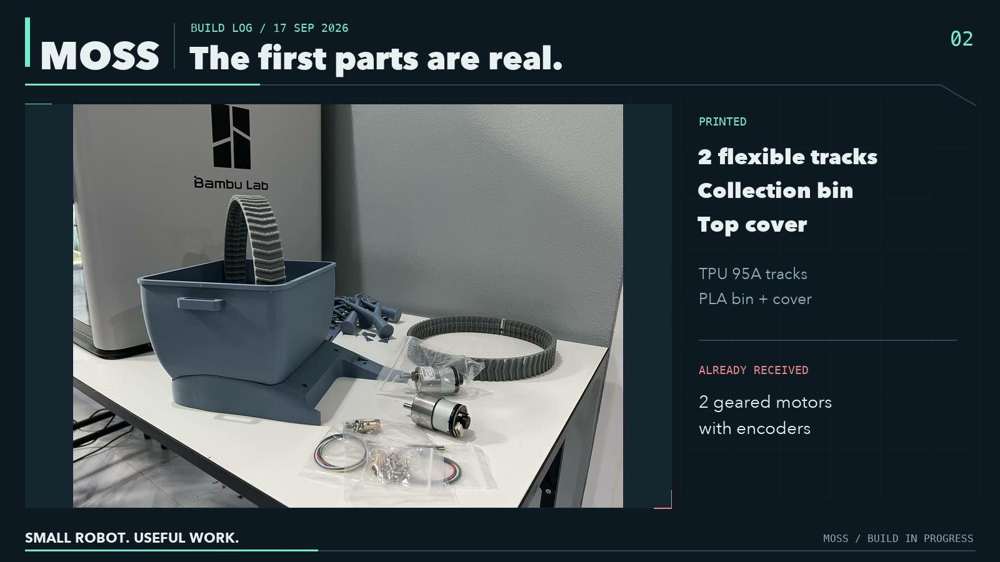
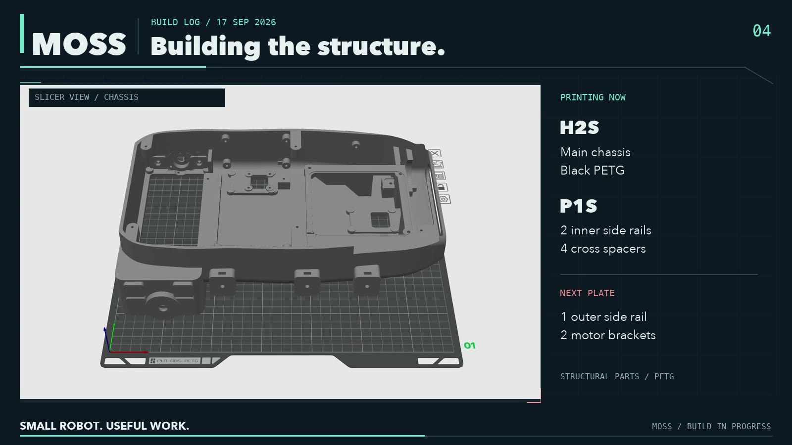
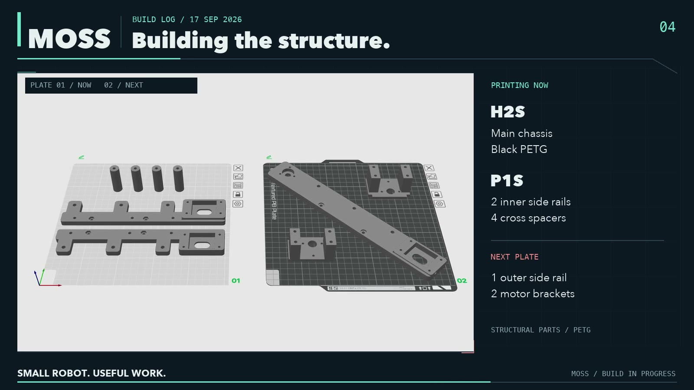
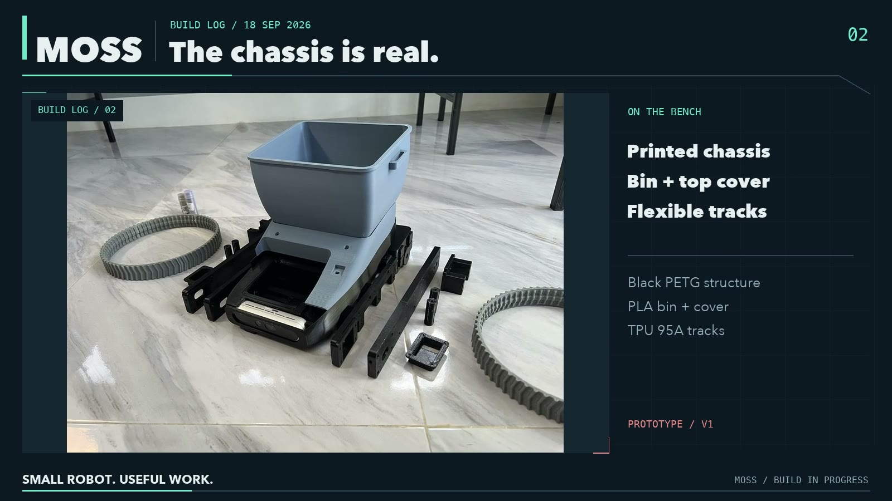
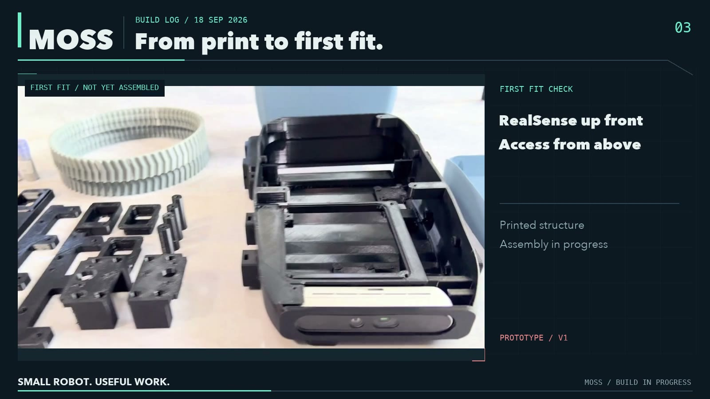
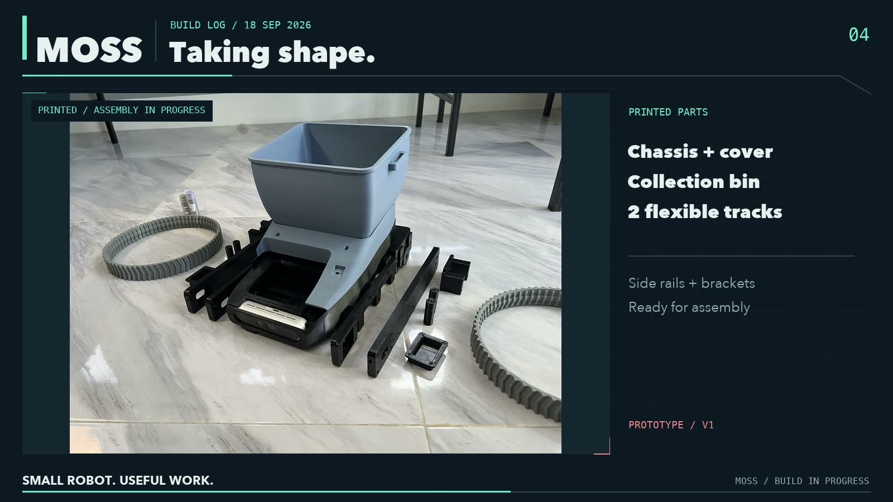
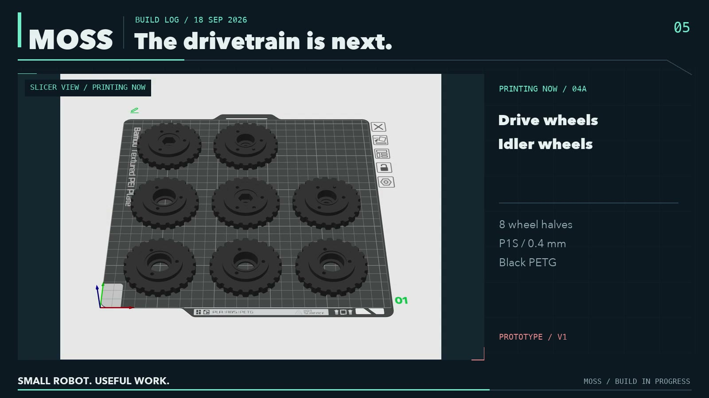
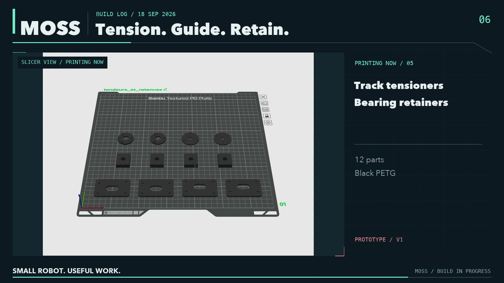
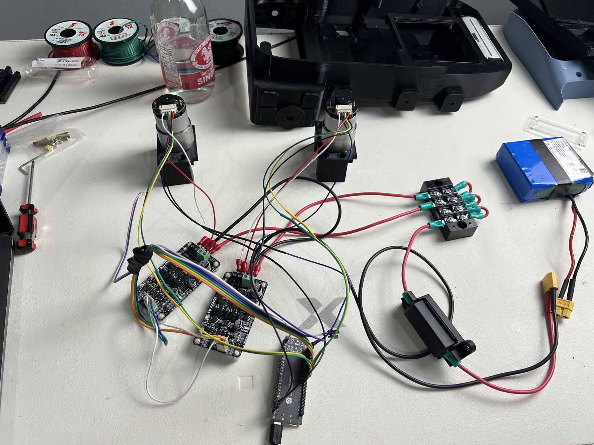
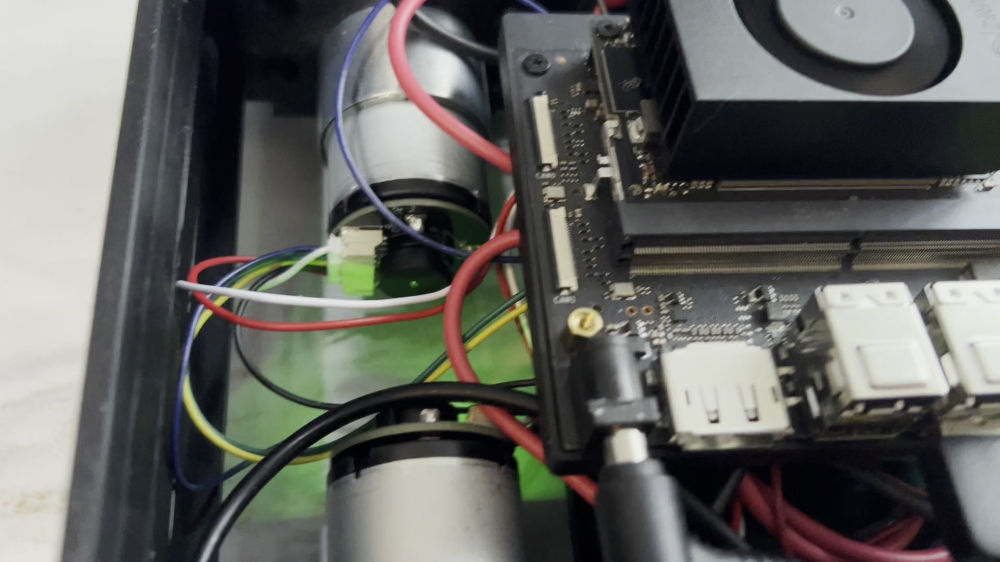

# Build log

## 2026-09-15
Concept video V2.3.1 published. Target parts cost stated: 500 to 700 USD plus a Jetson.

## 2026-09-16
First prints started on two printers: the collection bin (PLA, Bambu Lab H2S) and a flexible track (TPU 95A, Bambu Lab P1S). Both finished the same evening.

## 2026-09-17
Two tracks, the bin and its top cover are done. The main chassis is printing in PETG on the H2S; the inner side rails and cross spacers on the P1S. Next plate: one outer side rail and two motor brackets. Shafts, bearings, collars, couplings and fasteners ordered.

Video: `media/video/MOSS_build_update_20260917.mp4`.

## 2026-09-18
The main chassis came off the H2S in black PETG. First fit check on the bench: chassis, top cover, collection bin, the two flexible tracks, side rails and brackets. The RealSense sits up front, with access from above. Nothing is bolted yet; the parts go together with two or three small fit issues to correct in the next revision.

Printing now: the drivetrain, eight wheel halves (drive and idler wheels, 0.4 mm nozzle, black PETG, on the P1S), and a second plate of twelve parts, track tensioners and bearing retainers.

Next: fit the drivetrain, mount the arm, test on the ground.

Video: `media/video/MOSS_build_log_02_20260918.mp4`.

## 2026-09-19 — V0.3 print set, assembly continues

The V0.3 prototype's print set is reported essentially complete: chassis and motor hatch, collection bin and cover, track structure, wheels and rollers, tensioners and spacers, interior supports, the SO-101-derived arm, the NC90 parallel gripper, gaskets and gripper pads. The [printed-parts inventory](printed_parts.md) reconciles the delivered print plans and records the remaining checks.

Two tracks have been printed in TPU 95A. The first has good flexibility and grip in manual floor tests. The second, printed with a 0.8 mm nozzle, is too stiff and will be reprinted. The successful 0.4 mm profile is the reference to preserve; the replacement is not yet reported complete.

The printed cover stays on this prototype. Closing the front around the offset arm plate is deferred to the next hardware revision. The complete-cover study is parked and is not part of this build.

Before calling the set fully reconciled, identify the corrected pair of motor brackets and locate the two RealSense mounting brackets: the latter exist in the CAD export but were not found in the final numbered print plates. This is a print and assembly update; it does not report a completed drive test or autonomous pickup.

Bench video of the print set laid out, 19 September (20 s pan): [MOSS_print_set_bench_20260919.mp4](../media/video/MOSS_print_set_bench_20260919.mp4). Stills: [print set](../media/images/build_print_set_bench_20260919.jpg), [electronics side](../media/images/build_electronics_bench_20260919.jpg) — bin and cover, rails, chassis, wheels, arm and gripper parts, the Jetson in its cartridge, motors and boards.

Next: replace the stiff track, assemble and check the drivetrain, fit the arm and electronics, and record the first powered tests when they happen.

## 2026-09-20 — power and control harness, first motor and encoder tests

The print set is complete, camera brackets and corrected motor brackets included, and the mechanical hardware (shafts, bearings, collars, couplings, fasteners) is in. The power and control harness is assembled. Both drive motors and their quadrature encoders were tested on the bench from an Espressif ESP32-S3-DevKitC-1 V1.1 driving two Cytron MD10C R3. Video: [MOSS_motor_encoder_bench_20260920.mp4](../media/video/MOSS_motor_encoder_bench_20260920.mp4); photo: [the harness on the bench](../media/images/build_harness_bench_20260920.jpg).

The selected architecture now uses the ESP32-S3 as motor controller and a separate Waveshare Bus Servo Adapter (A) V1.1 for the SO-101 arm servos. The Waveshare General Driver for Robots is no longer part of the design. The arm was not tested in this session. The ESP32 was powered over USB-UART during the tests; the motors from the pack through the fuse and the positive distribution block, with common grounds.

Firmware: [`firmware/`](../firmware/README.md), the source actually flashed after the tests (25 % commissioning limit). Wiring map in its README. Host logic test: `g++ -std=c++17 firmware/tests/control_test.cpp && ./a.out`.

### Results

| Test | Left encoder delta | Right encoder delta | Invalid transitions (L/R) |
|---|---:|---:|---:|
| Individual 15 % PWM, 1 s each | −704 | −712 | 0 / 0 |
| Both motors: positive 4 s ramp / 2 s at 100 % / 4 s ramp down | −38 083 | −38 609 | 0 / 0 |
| Both motors: negative 4 s ramp / 2 s at 100 % / 4 s ramp down | +40 340 | +41 679 | 1 / 2 |

Raw traces: [`hardware/bench/20260920/`](../hardware/bench/20260920/). Commanded and timed stops and the disarmed state were confirmed. Positive commands produced clockwise rotation seen from the rear of each motor, with negative tick counts. Forward direction and encoder signs still have to be set after the mirrored installation on the rover. The percentages are PWM duty, not a regulated speed. Tick counts are raw ×4 quadrature counts, not distance. The invalid-transition counters do not catch every possible encoder error.

The 100 % cycle used a temporary firmware; the 25 % limit was restored afterwards and further unloaded 25 % tests (left, right, both, 2 s) completed with no additional invalid transition. No loaded, stall, endurance or ground-driving test has been done.

### Battery monitoring

INA219 communication at 0x40 works and the pack read around 11.95–11.97 V: a voltage indication, not a calibrated state of charge nor per-cell monitoring. The module carries a 0.1 Ω R100 shunt, but in the tested wiring the motor current bypasses that shunt (the fuse-to-distribution link stays direct; the module's small terminal does not take the main cable). The currents in [`ina_bypassed_NOT_motor_current.json`](../hardware/bench/20260920/ina_bypassed_NOT_motor_current.json) are therefore not motor consumption and must not be used for fuse sizing, power claims or current protection. Decision: keep the INA219 for voltage only on this prototype. The firmware provides no battery undervoltage cutoff.

### Protection and cabling

Fuse for the motor bench tests: 5 A automotive blade, 32 V DC, same format as the holder. This is not the final rating for the rover with Jetson and arm; the pack's BMS thresholds are unknown. Cable runs of 25–30 cm at most; conductor bundle measured 1.2 mm in diameter, section estimated at 0.75–1 mm², not verified.

Next: integrate the harness into the chassis, set installed motor and encoder directions, measure ticks per revolution, then the Jetson interface and speed control. For the next hardware revision: mounts for the ESP32-S3, the servo adapter and the real distribution; the printed V0.3 stays the reference.

## 2026-09-20 (evening) — electronics in the chassis, Jetson on battery

First assembly of the electronics inside the printed chassis: motors, drivers, ESP32-S3, the pack in its bay, and the Jetson, which now boots from battery power. Video: [MOSS_first_assembly_20260920.mp4](../media/video/MOSS_first_assembly_20260920.mp4); still: [electronics in the chassis](../media/images/build_first_assembly_20260920.jpg).

First reality checks: some components ended up elsewhere than planned in CAD. The differences go into [assembly_feedback.md](assembly_feedback.md) as they are measured, and into the next hardware revision. No drive test yet.

