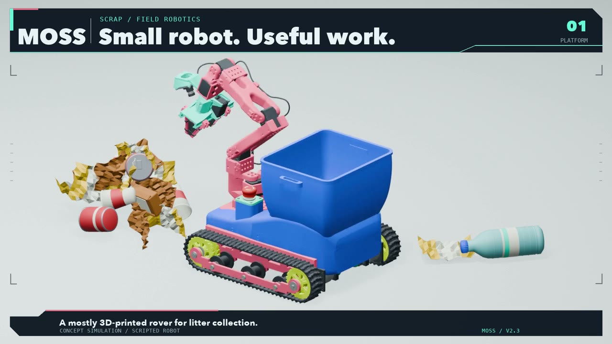

# Concept

MOSS is a litter-picking rover for sidewalks, roadsides and parks: small enough to print, cheap enough to build several, useful enough to keep.

- Tracked base (two motors with encoders, differential drive), printed tracks in TPU.
- Collection bin on top, emptied by hand at the end of a run.
- Arm derived from the SO-101 (6 DoF, open source) with a NormaCore parallel gripper.
- Brain: Jetson Orin Nano 8 GB; perception: an Intel RealSense depth camera.
- Software: dimOS for navigation and teleop, LeRobot for data and policies.

The criterion we use for success: pick up more litter with less technology. Every added part has to earn its place against a person with a bag.

Concept video (V2.3.1, 15 September 2026): `media/video/MOSS_V2_3_1_20260915.mp4` (concept simulation, scripted robot; not a demo of a working policy).
